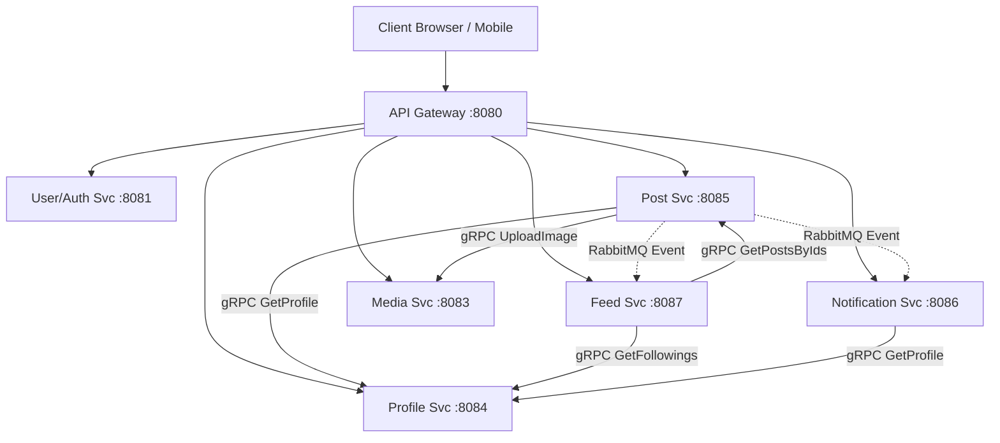

# Architecture & Tech Stack — Media-Based Social Networking Platform

## Overview

A **Java Spring Boot** backend for a media-first social networking platform. The system has been fully migrated from a legacy monolith into a **Microservices Architecture**. It utilizes **Spring Cloud Gateway** for routing, **gRPC** for high-performance synchronous inter-service communication, and **RabbitMQ** for asynchronous event-driven architecture (fan-out and notifications).

---

## Tech Stack

### Core Microservices

| Service | Port | Purpose | Key Technologies |
| --- | --- | --- | --- |
| **API Gateway** | 8080 | Unified entry point, routes HTTP traffic to microservices | Spring Cloud Gateway |
| **Monolith (Auth)** | 8081 | OAuth2 login, Session Management, User Identity | Spring Security, Redis Sessions |
| **Media Service** | 8083 (HTTP) / 9091 (gRPC) | Object storage integration (images) | MinIO, gRPC Server |
| **Profile Service** | 8084 (HTTP) / 9092 (gRPC) | User Profiles, Follower/Following graph | MySQL (`profile_db`), gRPC Server |
| **Post Service** | 8085 (HTTP) / 9093 (gRPC) | Posts and Comments creation & retrieval | MySQL (`post_db`), gRPC Server/Client, RabbitMQ |
| **Notification Service** | 8086 | Real-time WebSocket push notifications | MySQL (`notification_db`), Spring WebSocket, STOMP |
| **Feed Service** | 8087 | Aggregates feeds (Dynamic & Precomputed Redis) | Redis, RabbitMQ, gRPC Clients |

### Infrastructure & Data Storage

| Technology | Purpose | Details |
| --- | --- | --- |
| **MySQL** | Relational Database | 4 isolated schemas: `user_db`, `profile_db`, `post_db`, `notification_db` |
| **Redis** | Cache + Session + Feed | Shared session store (`engineerpro:app`) and Feed lists (`feed:{profileId}`) |
| **MinIO** | Object Storage | S3-compatible storage for post images |
| **RabbitMQ** | Message Queue & STOMP | Async events (`after-create-post-queue`) and STOMP WebSocket relay |
| **gRPC** | Inter-Service Communication | High-performance synchronous Protobuf RPCs |
| **Docker Compose** | Orchestration | Deploys the entire 11-container ecosystem |

---

## Infrastructure Architecture

> **Data Sovereignty**: Each microservice strictly connects to its own independent MySQL database schema (`user_db`, `profile_db`, `post_db`, `notification_db`).

---

## Microservices Design

### 1. API Gateway

Replaces Nginx as the single entry point. It maps incoming `/media/**`, `/profiles/**`, `/posts/**`, `/notifications/**`, and `/oauth2/**` routes to their respective internal Spring Boot containers.

### 2. Profile Service

Owns the `profile` and `user_following` tables. It exposes a gRPC server so that other services (Post, Feed, Notification) can retrieve profile data (username, avatar) to hydrate their own DTOs without direct database access.

### 3. Post Service

Owns the `post` and `comment` tables.

- Replaces JPA relationships to Profile with a simple `createdByProfileId` integer.
- Uses `ProfileServiceGrpcClient` to fetch author details dynamically.
- Publishes a `NotificationEvent` to RabbitMQ whenever a post is created or liked.

### 4. Feed Service

Implements a dual-feed strategy:

- **Dynamic Feed**: Pulls the user's followings via gRPC, then fetches recent posts from those users via gRPC.
- **Precomputed Feed**: Consumes RabbitMQ events when new posts are created, fetching the author's followers via gRPC, and pushing the new `postId` to Redis lists (`feed:{followerId}`).

### 5. Notification Service

Owns the `notification` table.

- Consumes RabbitMQ events asynchronously.
- Saves notifications to `notification_db`.
- Uses `ProfileServiceGrpcClient` to hydrate the notification payload.
- Pushes the hydrated JSON to connected clients via WebSockets (`/topic/notifications/{username}`).

### 6. Auth / Monolith

The gutted remnants of the original monolith. It now solely handles OAuth2 authentication flows and creates Redis-backed user sessions. All application traffic is authenticated via the shared Redis session store.

---

## Key Architectural Decisions

| Decision | Choice | Rationale |
| --- | --- | --- |
| **Inter-Service (Sync)** | gRPC | HTTP/2 binary serialization is massively faster and more strictly typed than REST/JSON for high-volume internal queries (like hydrating feeds). |
| **Inter-Service (Async)** | RabbitMQ | Decouples heavy fan-out operations (feed generation, notifications) from the main request thread. |
| **Database Isolation** | 1 schema per service | Enforces loose coupling. Services cannot bypass APIs to read another service's tables via SQL JOINs. |
| **Session Management** | Redis-backed | Enables stateless microservices. Any service can verify authentication by checking the Redis session cookie. |
| **Gateway** | Spring Cloud Gateway | Natively integrates with the Spring ecosystem and allows programmatic route manipulation. |
