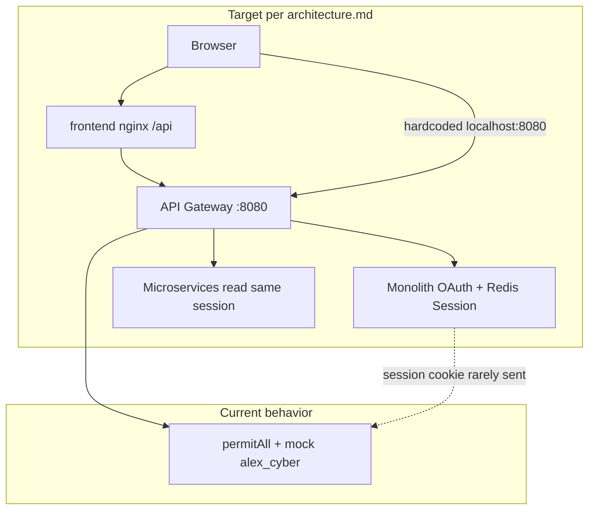

# Media Social Platform — Fix Roadmap

Local planning document (listed in `.gitignore` — not pushed to remote). Aligns fixes with [architecture.md](architecture.md).

---

## Current project status

### What is in place (working skeleton)

| Layer | Status | Notes |
|-------|--------|-------|
| **Infrastructure** | Deployable | [docker-compose.yml](docker-compose.yml): MySQL, Redis, RabbitMQ, MinIO, 6 microservices + monolith + gateway + frontend |
| **API Gateway** | Partial | [api-gateway/src/main/resources/application.yml](api-gateway/src/main/resources/application.yml) routes `/media`, `/profiles`, `/posts`, `/comments`, `/dynamic-feeds`, `/precomputed-feeds`, `/notifications`, WebSocket, OAuth paths |
| **Auth monolith** | Functional | [src/main/java/com/socialnetwork/config/SecurityConfig.java](src/main/java/com/socialnetwork/config/SecurityConfig.java) + OAuth2; Redis session via [SessionConfig](src/main/java/com/socialnetwork/config/SessionConfig.java) (`engineerpro:app`) |
| **Microservices** | Extracted | profile, post, media, feed, notification with gRPC + RabbitMQ per architecture |
| **Post domain** | Mostly correct | `createdByProfileId`, gRPC to profile/media, RabbitMQ on create |
| **Feed strategies** | Backend only | Dynamic (gRPC pull) + precomputed (Redis + Rabbit fan-out) |
| **Frontend** | UI shell | React + Vite + nginx proxy; Home/Profile read APIs; notifications drawer (STOMP) |
| **Seeding** | Dev-only | [seed.ps1](seed.ps1) hits gateway without real auth |

### What is broken or incomplete (demo mode)

| Area | Problem | Impact |
|------|---------|--------|
| **Session auth** | Only monolith + post-service enable `@EnableRedisHttpSession`; profile/feed lack SessionConfig; all services use `permitAll()` | No real user identity in microservices |
| **Mock user** | `00000000-...` / `alex_cyber` fallback in controllers + frontend | Everyone acts as one user; security bypass |
| **Gateway** | Missing `/auth/**` route | `/auth/inspect` unreachable via gateway |
| **post-service config** | [application.yml](post-service/src/main/resources/application.yml) is a copy of profile-service (wrong name, ports, missing RabbitMQ/gRPC) | Wrong local defaults; confusion |
| **feed-service config** | No `application.yml` | gRPC/Redis/Rabbit rely on implicit defaults |
| **profile-service security** | Security on classpath, no SecurityConfig/SessionConfig; OAuth2 config on wrong service | Unpredictable 401s or open endpoints |
| **Frontend API** | [api.ts](frontend/src/services/api.ts): `localhost:8080`, no `credentials`, ignores `/api` proxy | CORS/cookie failures; Docker breakage |
| **API contract** | Post/profile wrap `BaseResponse`; frontend expects flat `{ posts }` | Empty UI despite 200 OK |
| **Feed hydration** | gRPC feed DTOs lack author username/avatar | Home feed shows "Unknown" |
| **Features** | Create/Explore/Notifications pages stubbed; dynamic feed only; no follow seed | Limited E2E demo |
| **Tests** | Monolith tests deleted; little microservice coverage | Regressions likely |
| **Legacy** | [nginx/conf/app.conf](nginx/conf/app.conf) still monolith upstream | Misleading ops docs |

---

## Fix strategy (phased)

Work in order: **config and gateway first** (services can start correctly), then **auth** (foundation), then **frontend contract**, then **features and quality**.

---

## Phase 1 — Configuration and gateway (foundation)

**Goal:** Every service starts with correct ports, DB, Redis, gRPC, and RabbitMQ; gateway exposes all public HTTP paths.

### Step 1.1 — Rewrite post-service `application.yml`

- Set `spring.application.name: post-service`
- HTTP port `8085`, gRPC server `9093`
- MySQL `post_db` (local + `docker-compose` profile)
- Redis host/port (match monolith, namespace already in SessionConfig)
- RabbitMQ queue config (mirror [MessageQueueConfig](post-service/src/main/java/com/socialnetwork/post/config/MessageQueueConfig.java))
- `grpc.client` for `media-service` and `profile-service`
- Remove OAuth2 client block (auth stays in monolith only)

### Step 1.2 — Add feed-service `application.yml`

Create [feed-service/src/main/resources/application.yml](feed-service/src/main/resources/application.yml):

- `server.port: 8087`
- Redis (feed lists + optional session)
- RabbitMQ consumer for `after-create-post-queue`
- `grpc.client` for `profile-service` (9092) and `post-service` (9093)
- `docker-compose` profile overrides (hosts: `redis`, `rabbitmq`, `profile-service`, `post-service`)

### Step 1.3 — Fix profile-service `application.yml`

- Default port `8084` (not `8092`)
- Default datasource `profile_db` (not `spring_session`)
- Remove OAuth2 client registration (or disable if unused)
- Keep gRPC server + media client

### Step 1.4 — Extend API Gateway routes

In [api-gateway/src/main/resources/application.yml](api-gateway/src/main/resources/application.yml):

- Add route: `/auth/**` → user-service (monolith)
- Optional: `/swagger-ui/**`, `/api-docs/**` per service if needed for dev
- Review CORS: prefer same-origin `/api` from frontend; if SPA on `:3000`, set explicit `allowedOrigins` + `allowCredentials: true` (not `*` with cookies)

### Step 1.5 — Cleanup stale ops artifacts

- Mark [nginx/conf/app.conf](nginx/conf/app.conf) deprecated or remove from active deploy path
- Document in README that entry is **gateway :8080**, frontend **:3000** → `/api`

**Verification:** `docker compose up`; hit actuator health on 8083–8087; gRPC connectivity smoke (feed can call profile/post).

---

## Phase 2 — Shared Redis session and security

**Goal:** Match architecture.md — monolith writes session; microservices read it and require authentication on protected endpoints.

### Step 2.1 — Standardize SessionConfig on consuming services

Add to **profile-service**, **feed-service** (and verify **post-service**):

- `@EnableRedisHttpSession(redisNamespace = "engineerpro:app")`
- `ObjectMapper` bean with `SecurityJackson2Modules` (copy from [monolith SessionConfig](src/main/java/com/socialnetwork/config/SessionConfig.java))

### Step 2.2 — SecurityFilterChain per service

For profile, post, feed (and notification if REST is added):

- `permitAll`: swagger, actuator, WebSocket handshake paths
- `authenticated()`: `/profiles/**`, `/posts/**`, `/comments/**`, `/dynamic-feeds/**`, `/precomputed-feeds/**` (adjust public read if product requires)
- `csrf().disable()` (API + session cookie pattern)
- Ensure `spring-session-data-redis` + `spring-boot-starter-data-redis` dependencies align

### Step 2.3 — Session principal deserialization

**Risk:** Monolith [UserPrincipal](src/main/java/com/socialnetwork/dto/UserPrincipal.java) implements `OAuth2User`; post-service [UserPrincipal](post-service/src/main/java/com/socialnetwork/post/dto/UserPrincipal.java) is `UserDetails` only.

- Align principal type across services (profile already mirrors monolith OAuth2User — good template)
- Or configure Spring Session Jackson typing / `@JsonTypeInfo` so all services deserialize the same class graph
- Test: login via monolith → call `/auth/inspect` through gateway → call `/profiles/me` on profile-service with same cookie

### Step 2.4 — Remove all mock-user fallbacks

Replace in:

- [DynamicFeedController](feed-service/src/main/java/com/socialnetwork/feed/controller/DynamicFeedController.java)
- [PreComputedFeedController](feed-service/src/main/java/com/socialnetwork/feed/controller/PreComputedFeedController.java)
- [PostController](post-service/src/main/java/com/socialnetwork/post/controller/PostController.java), [CommentController](post-service/src/main/java/com/socialnetwork/post/controller/CommentController.java)
- [ProfileController](profile-service/src/main/java/com/socialnetwork/profile/controller/ProfileController.java), [FollowerController](profile-service/src/main/java/com/socialnetwork/profile/controller/FollowerController.java)

**Pattern:** if `authentication == null` → `401 Unauthorized` (not `alex_cyber`).

### Step 2.5 — Update seed script

[seed.ps1](seed.ps1): document that seeding requires an authenticated session cookie, or provide a dev-only profile that temporarily permits seed endpoints (explicitly flagged, not default).

**Verification:** Unauthenticated API calls return 401; after Google OAuth login, `/profiles/me` and `/dynamic-feeds` return real user data.

---

## Phase 3 — Frontend integration

**Goal:** Browser talks to gateway through `/api`, sends session cookies, parses backend DTOs correctly.

### Step 3.1 — Fix [api.ts](frontend/src/services/api.ts)

- `const BASE_URL = '/api'` (works with Vite proxy and production nginx)
- Add `credentials: 'include'` on all `fetch` calls
- Parse `BaseResponse<T>` for post/profile endpoints: use `data.posts`, `data.profile`, etc.
- Keep feed as direct `GetFeedResponse` (no wrapper) or align backend — pick one contract

### Step 3.2 — Auth UX

- Add login link → gateway `/oauth2/authorization/google` (or `/login`)
- On app load: `GET /api/auth/inspect` → store user in React context
- Redirect unauthenticated users from Profile/Create to login
- [App.tsx](frontend/src/App.tsx): pass real `username` from context to [NotificationDrawer](frontend/src/components/NotificationDrawer.tsx)

### Step 3.3 — Align WebSocket path

NotificationDrawer already uses `/api/gs-guide-websocket` — confirm nginx + gateway route match; fix [frontend/nginx.conf](frontend/nginx.conf) `/ws/` block if redundant.

**Verification:** `npm run dev` with compose up: feed and profile load after login; no direct `:8080` calls from browser.

---

## Phase 4 — API and feed quality

**Goal:** UI shows rich data; feeds behave per architecture.

### Step 4.1 — Hydrate feed posts (gRPC layer)

In [PostServiceGrpcClient.toDto](feed-service/src/main/java/com/socialnetwork/feed/grpc/PostServiceGrpcClient.java) (or service layer):

- After loading posts, batch-fetch profiles via [ProfileServiceGrpcClient](feed-service/src/main/java/com/socialnetwork/feed/grpc/ProfileServiceGrpcClient.java)
- Populate `createdBy.username`, `profileImageUrl`

### Step 4.2 — Dynamic feed pagination

- Call existing `countPostsByAuthors` gRPC from post-service
- Set `totalPage` in [DynamicFeedServiceImpl](feed-service/src/main/java/com/socialnetwork/feed/service/DynamicFeedServiceImpl.java) (remove hardcoded `1`)

### Step 4.3 — Preserve precomputed feed order

In post-service gRPC `getPostsByIds`, reorder results to match requested ID list (Redis order).

### Step 4.4 — Seed follow graph

Extend seed script or SQL init: create `user_following` rows so dynamic feed is non-empty for demo user.

### Step 4.5 — Fail fast on media upload

In [PostServiceImpl.createPost](post-service/src/main/java/com/socialnetwork/post/service/PostServiceImpl.java): if `uploadImage` returns null, throw `InvalidInputException` instead of saving broken posts.

**Verification:** Home shows avatars/usernames; pagination works; precomputed feed optional toggle in UI.

---

## Phase 5 — Feature completion and hardening

> **Default feed: dynamic.** `Home.tsx` calls `api.getFeed('/dynamic-feeds')`. The precomputed feed (`/precomputed-feeds`, populated by the RabbitMQ fan-out) is available as an opt-in via a UI toggle (not yet shipped). The dynamic feed pulls from MySQL via the post-service gRPC `getPostsByAuthors` and is the source of truth; the precomputed feed is an optimisation that may lag by seconds when the fan-out is in flight.

**Goal:** Close gaps between UI and backend capabilities.

| Step | Task |
|------|------|
| 5.1 | Implement Create Post page (multipart/base64 → `POST /api/posts`) |
| 5.2 | Profile: followers/following counts via `/followers` APIs |
| 5.3 | Notifications page or wire drawer to real persisted notifications |
| 5.4 | Choose default feed: dynamic vs `/precomputed-feeds` (document in plan) |
| 5.5 | Restore/add integration tests (post repository, feed service, auth inspect) |
| 5.6 | Remove duplicate DTOs in monolith `src/` where unused (optional cleanup) |

---

## Phase 6 — Documentation and repo hygiene

- Update [README.md](README.md): architecture summary, login flow, local dev URLs (`:3000` frontend, `/api` proxy)
- Un-ignore or duplicate `architecture.md` for collaborators if the team should share it on remote
- Document env vars: `GOOGLE_CLIENT_ID`, Redis, MySQL schemas

---

## Suggested execution order (checklist)

- [x] Phase 1 — configs + gateway routes
- [x] Phase 2 — Redis session + security + remove mock user
- [x] Phase 3 — frontend `api.ts` + auth flow
- [x] Phase 4 — feed hydration, pagination, upload fail-fast
- [ ] Phase 5 — create post, notifications, tests
- [ ] Phase 6 — README and shared architecture docs

---

## Success criteria (definition of done)

- User logs in via OAuth on monolith; session cookie works through gateway to profile/post/feed
- No hardcoded `alex_cyber` in production code paths
- `docker compose up` + frontend on `:3000` shows real feed and profile for logged-in user
- post-service and feed-service have correct `application.yml`
- `GET /api/auth/inspect` returns current user through gateway
- Seed data includes follows so dynamic feed has posts
